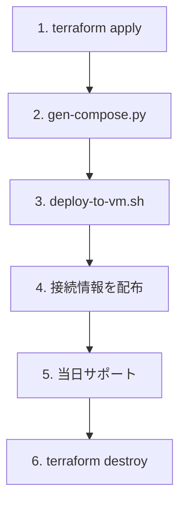

# 主催者向け README

ブラウザ上の VS Code（code-server）環境を Azure VM 上に構築し、参加者に配布するための手順です。

## 前提条件

| 項目 | 内容 |
|------|------|
| 主催者のみ | Azure サブスクリプションへのアクセス権（Contributor 以上） |
| ローカルツール | Terraform 1.6+、Azure CLI（`az login` 済み）、Python 3.10+、SSH |
| SSH 鍵 | VM メンテナンス用の公開鍵 |
| 参加者 | Azure / GitHub アカウント不要（接続情報のみ配布） |

## ディレクトリ構成

```
infra/
├── terraform/          # VM・ネットワーク・Service Principal
├── docker/             # code-server 用 Dockerfile
├── workshop/           # 難易度別 Terraform（初級 / 中級 / 上級 / 完成形）
├── scripts/            # 生成・デプロイ・配布用スクリプト
├── credentials/        # 参加者 CSV（git 管理外）
├── README-organizer.md # 本ファイル
└── README-participant.md
```

## 手順概要



---

## 1. 事前準備

### 1.1 Azure CLI でログイン

```bash
az login
az account set --subscription "<サブスクリプション ID>"
```

### 1.2 変数ファイルの作成

```bash
cd infra/terraform
cp terraform.tfvars.example terraform.tfvars
```

`terraform.tfvars` を編集します。

| 変数 | 説明 |
|------|------|
| `admin_ssh_public_key` | 主催者の SSH 公開鍵（必須） |
| `participant_count` | 参加者数（= code-server コンテナ数） |
| `base_port` | 先頭ポート（デフォルト 8001 → 8001, 8002, …） |
| `participant_allowed_source_address_prefixes` | 参加者（code-server）の接続元 CIDR リスト |
| `organizer_allowed_source_address_prefixes` | 主催者（SSH）の接続元 CIDR リスト |
| `vm_size` | VM サイズ（10 人程度なら `Standard_D4s_v5` 推奨） |

#### 接続元 IP 制限（NSG）

VM の NSG に、変数で指定した CIDR からの Inbound のみを許可します。未指定時は `["*"]`（全世界）です。

```hcl
# 参加者: 社内オフィスのグローバル IP レンジのみ
participant_allowed_source_address_prefixes = ["203.0.113.0/24"]

# 主催者: 自宅の固定 IP のみ SSH 可（参加者より狭くする例）
organizer_allowed_source_address_prefixes = ["198.51.100.50/32"]

# 拠点が複数ある場合
participant_allowed_source_address_prefixes = [
  "203.0.113.0/24",
  "198.51.100.0/24",
]
```

| 変数 | 対象ポート | 用途 |
|------|-----------|------|
| `participant_allowed_source_address_prefixes` | `base_port` 〜（code-server） | 参加者のブラウザアクセス |
| `organizer_allowed_source_address_prefixes` | 22（SSH） | `deploy-to-vm.sh` など主催者操作 |

変更後は `terraform apply` で NSG が更新されます。

### 1.3 社内ネットワークの事前確認（推奨）

社内 PC のブラウザから、将来開放するポート（例: `http://<任意のIP>:8001`）がブロックされないか、可能であれば事前に確認してください。非標準ポートが禁止されている場合は、リバースプロキシ（443 番）の追加構成が必要です。

---

## 2. インフラのデプロイ

```bash
cd infra/terraform
terraform init
terraform plan
terraform apply
```

作成される主なリソース:

| リソース | 用途 |
|---------|------|
| Linux VM | code-server ホスト |
| Public IP | 参加者がブラウザでアクセス |
| NSG | SSH(22) + code-server ポート範囲 |
| Service Principal | 参加者 Terraform 用（`az login` 不要） |
| `rg-workshop-*` | 参加者が `terraform apply` する先の RG（全員共有） |
| `privatelink.blob.core.windows.net` | 上記 RG 内の共有 Private DNS ゾーン（参加者は data 参照のみ） |

参加者用 Terraform（`infra/workshop/`）は **新規 RG を作らず**、共有 RG に `owner`（`user01` など）入りの名前でリソースを作成します。`gen-compose.py` が `TF_VAR_owner` と `TF_VAR_resource_group_name` を各席に注入します。

apply 完了後、以下で接続先 IP を確認できます。

```bash
terraform output vm_public_ip
terraform output workshop_resource_group_name
```

---

## 3. code-server 環境の生成と VM への配置

### 3.1 Docker Compose・パスワードの生成

```bash
cd infra
python3 scripts/gen-compose.py
```

以下が生成されます。

| 出力 | 内容 |
|------|------|
| `docker/generated/docker-compose.yml` | 参加者数分の code-server 定義 |
| `docker/generated/.env` | SP 認証情報・各席パスワード |
| `docker/workspaces/userNN/` | 参加者ごとの workshop コピー |
| `credentials/participants.csv` | URL・パスワード一覧（配布用） |

### 3.2 VM へデプロイ

```bash
chmod +x scripts/deploy-to-vm.sh scripts/print-handout.sh
SSH_KEY=~/.ssh/id_rsa ./scripts/deploy-to-vm.sh
```

初回は VM 起動直後のため、cloud-init 完了まで 2〜3 分待ってから実行してください。

デプロイ内容:

- `/opt/workshop/docker/` … Dockerfile・compose・.env
- `/opt/workshop/workspaces/` … 参加者ごとの Terraform ワークスペース
- `docker compose up -d` で全コンテナ起動

### 3.3 動作確認（主催者）

```bash
# 接続情報の表示
./scripts/print-handout.sh

# または CSV を直接確認
cat credentials/participants.csv
```

ブラウザで席 1 の URL を開き、パスワードでログインできることを確認します。

---

## 4. 参加者への配布

`credentials/participants.csv` から、**席番号ごとに** URL とパスワードを配布します。

配布例（席 1）:

```
URL:       http://20.x.x.x:8001
パスワード: xK9mP2aB4cD5eF6g
```

参加者向けの操作手順は [README-participant.md](./README-participant.md) を共有してください。

---

## 5. 当日の運用

### コンテナの再起動

```bash
ssh azureuser@<VM_IP>
cd /opt/workshop/docker
sudo docker compose restart
sudo docker compose ps
```

### ログ確認

```bash
sudo docker compose logs -f user01
```

### ワークショップ用 Terraform の更新

配布する難易度フォルダ（例: `infra/workshop/初級`）を更新した場合:

1. `infra/scripts/gen-compose.py` の `WORKSHOP_SRC` がそのフォルダを指していることを確認
2. 以下を実行

```bash
python3 scripts/gen-compose.py   # workspaces を再同期
./scripts/deploy-to-vm.sh
```

> テンプレート更新後に **既に apply 済みの参加者** がいる場合、state と Azure 上のリソース名がずれることがあります。本番ハンズオン前に反映するか、全席 `terraform destroy` 後に workspace を再生成してください。

完成形（答え合わせ）は `infra/workshop/完成形/` にあります。参加者 workspace にはコピーされません。

### 主催者 terraform を再 apply する場合

共有 Private DNS ゾーンは `infra/terraform/workshop_shared.tf` で管理しています。初回 apply 後、参加者に難易度別テンプレート（`workshop/初級` など）を配布する前に、必ず主催者側の `terraform apply` が完了していることを確認してください。

---

## 6. 片付け（必須）

ハンズオン終了後、コストとセキュリティのため必ず削除してください。

```bash
# VM 上のコンテナ停止（任意・destroy 前）
ssh azureuser@<VM_IP> 'cd /opt/workshop/docker && sudo docker compose down'

# Azure リソース削除
cd infra/terraform
terraform destroy
```

`credentials/participants.csv` と `docker/generated/.env` もローカルから削除してください。

---

## トラブルシューティング

| 症状 | 対処 |
|------|------|
| ブラウザで接続できない | NSG の `participant_allowed_source_address_prefixes`、社内プロキシ、ポート開放を確認 |
| `terraform output` が失敗 | `infra/terraform` で `terraform apply` が完了しているか確認 |
| `deploy-to-vm.sh` が SSH 失敗 | cloud-init 完了待ち、`admin_ssh_public_key` の一致を確認 |
| 参加者の `terraform apply` が認証エラー | VM 上で `docker compose` 再起動、`.env` の ARM_* を確認 |
| Storage Account 名の重複 | 各席の `TF_VAR_owner` がユニークか確認（`user01` など） |

---

## セキュリティ上の注意

- Service Principal のシークレットと参加者パスワードは **Git にコミットしない**（`.gitignore` 済み）
- 本構成は **研修・短期イベント向け** です。本番用途では HTTPS・個別 SP・ネットワーク分離を検討してください
- 終了後は必ず `terraform destroy` を実行してください
