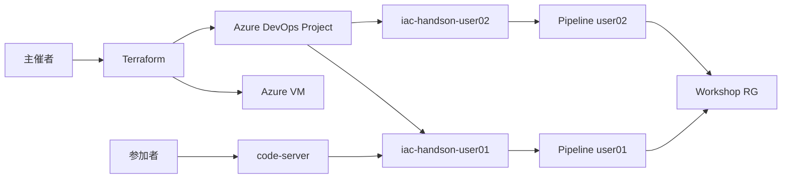

# 第三回 ワークショップ基盤

Azure VM 上の code-server から Azure Repos に push し、Azure Pipelines による Terraform CI/CD を体験するための構成です。

| ドキュメント | 対象 |
|-------------|------|
| [README-organizer.md](./README-organizer.md) | 主催者（構築・repo 初期化・配布・片付け） |
| [README-participant.md](./README-participant.md) | 参加者（code-server 接続・Git 操作・Pipeline 実行確認） |

## 構成



## クイックスタート（主催者）

```bash
cd 第三回/infra/terraform
cp terraform.tfvars.example terraform.tfvars
# terraform.tfvars を編集
terraform init
terraform apply

cd ..
./scripts/bootstrap-repos.sh
python3 scripts/gen-compose.py
./scripts/deploy-to-vm.sh
./scripts/print-handout.sh
```
